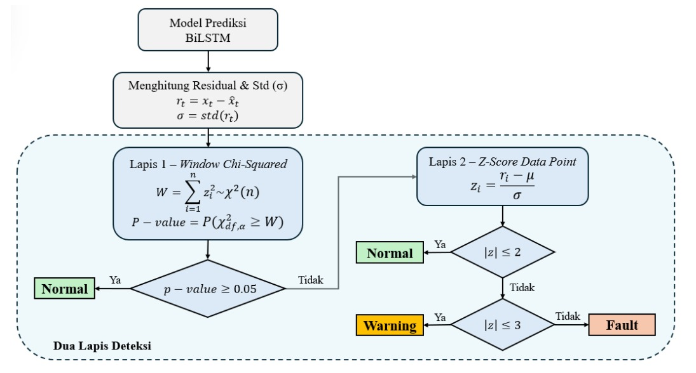
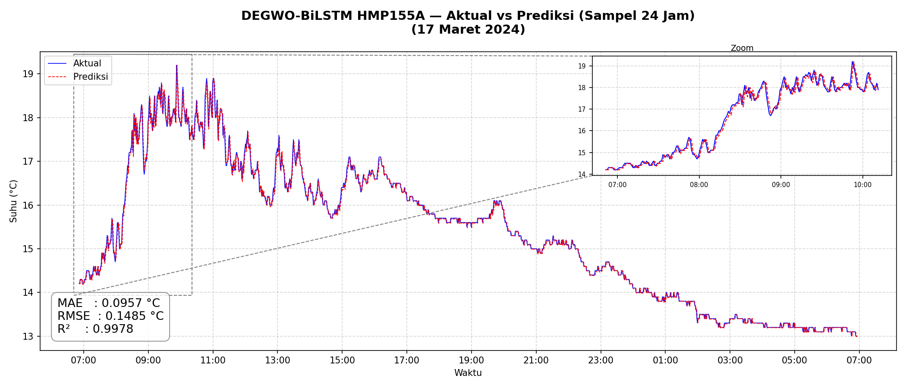
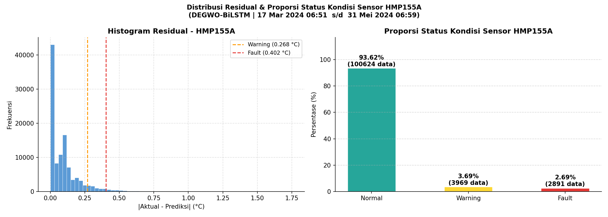

# Temperature-Sensor-Anomaly-Identification
Sistem identifikasi anomali pada sensor suhu *Automatic Weather Station* (AWS) BMKG berbasis analisis residual model prediksi **Bidirectional Long Short-Term Memory (BiLSTM)** yang dioptimasi dengan **Differential Evolution – Grey Wolf Optimizer (DEGWO)**, dilengkapi sistem identifikasi anomali dua lapis (Chi-Squared & Z-Score).

## Metode Penelitian

### BiLSTM
BiLSTM (Bidirectional Long Short-Term Memory) adalah pengembangan dari LSTM yang memproses data deret waktu dari dua arah (maju dan mundur), sehingga model dapat menangkap pola dari konteks masa lalu maupun masa depan sekaligus. Dalam penelitian ini, BiLSTM dilatih menggunakan data suhu historis masing-masing sensor untuk memprediksi nilai suhu berikutnya.

### DEGWO
DEGWO (Differential Evolution – Grey Wolf Optimizer) adalah metode optimasi metaheuristik hybrid yang menggabungkan Differential Evolution dan Grey Wolf Optimizer untuk mencari kombinasi hyperparameter BiLSTM (jumlah unit, dropout rate, learning rate, batch size) yang optimal dengan tujuan untuk mendapatkan performa model yang optimal.

### Alur Deteksi Dua Lapis

Setelah model BiLSTM menghasilkan prediksi, residual (selisih nilai aktual dan prediksi) dihitung, lalu diproses melalui dua lapis pengujian statistik berikut:



- **Lapis 1 (Window Chi-Squared)**: menguji sekumpulan residual dalam satu window menggunakan distribusi chi-squared. Jika *p-value* ≥ 0,05, window dinyatakan **Normal**; jika tidak, dilanjutkan ke Lapis 2.
- **Lapis 2 (Z-score per titik data)**: setiap titik data residual dihitung z-score-nya, lalu diklasifikasikan sesuai ambang batas berikut:

```
Status = Normal,   jika |z| ≤ 2
         Warning,  jika 2 < |z| ≤ 3
         Fault,    jika |z| > 3
```

## Hasil

### Aktual vs Prediksi


### Distribusi Residual & Proporsi Status Kondisi Sensor

